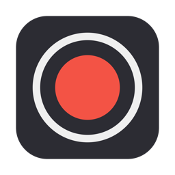
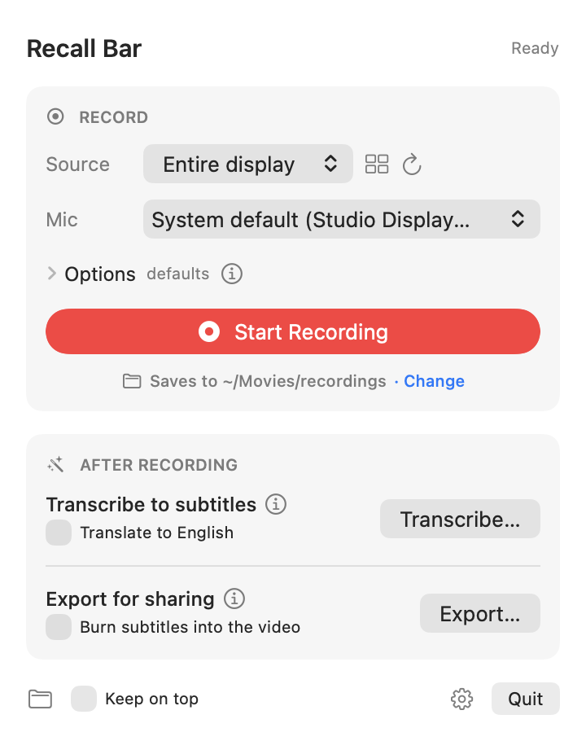

<p align="center">
  
</p>

<h1 align="center">Recall Bar</h1>

<p align="center">
  <strong>Headless meeting recorder for macOS.</strong><br>
  Records your screen, the meeting audio, and your microphone as <em>separate tracks</em> —
  no bot in the call, no overlay on your screen, nothing uploaded anywhere.
</p>

<p align="center"><sub>Formerly RecBar — the repository and the <code>rec</code> command keep that name.</sub></p>

<p align="center">
  📖 <strong><a href="docs/user-guide.md">User Guide</a></strong> — install, record, transcribe and share, step by step
</p>

<p align="center">
  <a href="https://github.com/Apptechkai/recbar/actions"></a>
  
  
</p>

---

Most meeting recorders either send a bot into your call, upload your audio to
someone's cloud, or draw a toolbar over the screen you're presenting. Recall Bar
does none of that. It sits in the Dock (or runs from a terminal), captures
what you tell it to via Apple's ScreenCaptureKit, and writes one `.mov`:

| Track   | Contents                                    | Codec                       |
| ------- | ------------------------------------------- | --------------------------- |
| Video   | Display, one window, or all windows of an app | HEVC ~4 Mbps (≈1.8 GB/hour) |
| Audio 1 | System audio — the other participants       | AAC 48 kHz stereo           |
| Audio 2 | Microphone — you                            | AAC 48 kHz mono             |

The two audio tracks are **never mixed**. That's the whole point: each side of
the conversation can be transcribed on its own, so "who said what" is exact
instead of guessed by a diarization model.

<p align="center">
  
</p>

## Features

- **Capture what you choose** — the whole display, a single window, or an
  entire app. Window/app capture also **limits the recorded audio to that app**,
  so Slack pings and Spotify stay out of the meeting track.
- **Invisible while you present** — no floating toolbar, no countdown, no
  frame. Only macOS's own purple recording indicator (unavoidable).
- **Dock icon with a REC badge**, live level meters for mic and system audio,
  a live thumbnail of what's being captured, and a **"no mic signal" warning**
  so you never finish a meeting to find your side missing.
- **Thumbnail source picker** (Window / App / Entire screen), plus a global
  hotkey (⌃⌥R) and a terminal-controllable CLI: `rec start`, `rec stop`.
- **Crash-resilient files** — written in 5-second fragments, so a force-quit
  or kernel panic mid-meeting still leaves a playable recording.
- **Audio clean-up in the background** — denoise, gentle compression,
  two-pass EBU R128 loudness normalization, run after Stop at low priority
  while you're free to start the next recording. Video is stream-copied,
  never re-encoded.
- **Local transcription to `.srt`** with WhisperKit (large-v3 on the Neural
  Engine); optional translate-to-English.
- **Speakers told apart and named** — your mic track is `[Me]`; the meeting
  track is split into Speaker 1, 2, 3… by on-device speaker separation. Rename
  them once (with a ▶ sample of each voice to tell who's who) and the
  subtitles update.
- **★ Markers** — press **⌃⌥M** (or `rec mark "label"`) right after something
  important is said. Markers become chapters in the video, and the transcript
  highlights what was said in the 15 seconds before each one.
- **Meeting detection** — when Zoom, Teams, Slack, Webex, FaceTime, Discord or
  a browser meeting (Google Meet, Teams or Zoom on the web) starts using your
  microphone, Recall Bar asks "Record this meeting?". When the call ends it
  offers to stop. It never records without your click.
- **Echo-cancelled microphone** — the mic is captured through macOS voice
  processing (the same path FaceTime uses), so the meeting audio coming out of
  your speakers doesn't end up on your mic track. Speakers work; headphones
  aren't required.
- **Microphone picker** — use your AirPods or headset without changing the
  system default.
- **Nothing leaves your Mac.** No account, no telemetry, no network calls
  (other than the one-time model download for transcription, if you opt in).


## Install

New to Terminal? The **[User Guide](docs/user-guide.md)** walks through every step with screenshots.

Recall Bar is currently installed by building it from source. A signed download
is planned; until then, one command does everything.

### Quick install (one command)

Open **Terminal** (⌘Space, type *Terminal*, press Return), paste this line and
press Return:

```sh
curl -fsSL https://raw.githubusercontent.com/Apptechkai/recbar/main/install.sh | bash
```

It never asks for your password. It installs Apple's command line tools if
they're missing (click *Install* in the dialog that appears), adds the helper
tools if you have [Homebrew](https://brew.sh), builds Recall Bar, puts it in
Applications and opens it. Then do the one manual step:
[grant two permissions](#3-first-launch-and-permissions).

Run the same line again any time to **update**. To **uninstall**:

```sh
curl -fsSL https://raw.githubusercontent.com/Apptechkai/recbar/main/install.sh | bash -s -- --uninstall
```

The script is short and commented — [read it first](install.sh) if you like
to know what you're running.

> **Using ChatGPT or Claude to help?** Paste this into the chat:
>
> *"Help me install Recall Bar on my Mac. The official instructions are at
> https://github.com/Apptechkai/recbar — I need to run one command in
> Terminal. Walk me through opening Terminal and running it, then help me
> grant the two permissions it mentions. Don't suggest any other commands or
> sources."*

### Manual install

The same steps by hand, if you prefer.

**You need:**

- macOS 15.2 or newer (developed and tested on Apple silicon)
- Xcode Command Line Tools — the compiler, no full Xcode required
- [Homebrew](https://brew.sh), for two optional helper tools

### 1. Install the prerequisites

```sh
xcode-select --install                 # skip if already installed
brew install ffmpeg whisperkit-cli     # optional, see below
```

`ffmpeg` powers the audio clean-up after each recording and "Export for
sharing"; `whisperkit-cli` powers transcription. Recording itself works
without either.

### 2. Build and install

```sh
git clone https://github.com/Apptechkai/recbar.git
cd recbar
make install-app                          # Recall Bar.app → /Applications
make install PREFIX="$(brew --prefix)/bin" # optional: the `rec` command-line tool
```

### 3. First launch and permissions

Open **Recall Bar** from Spotlight or Applications. It appears in the Dock, and
**⌃⌥R** opens its panel from anywhere. The first time you press Start, macOS asks
for two permissions — grant both to *Recall Bar* in **System Settings → Privacy &
Security**:

- **Screen & System Audio Recording**
- **Microphone**

Then quit Recall Bar (panel → Quit) and open it again; screen-recording permission
only takes effect after a relaunch. If you use the `rec` tool, macOS asks the
same for your terminal app (Terminal, iTerm, …) the first time you run it.

### 4. Check it works (optional)

```sh
make smoke
```

Records a few short test clips — it speaks through your speakers for about 30
seconds, so don't run it during a call (it refuses if another app is using
a microphone) — and verifies the files. All checks should pass.

### Updating

Installed with the one-command installer? Use **Settings → Check for Updates →
Update Now** in Recall Bar, or run the install line again. For a manual install:

```sh
cd recbar
git pull
make install-app
make install PREFIX="$(brew --prefix)/bin"   # if you use the CLI
```

### Uninstalling

Installed with the one-command installer? Use its `--uninstall` line above.
For a manual install:

```sh
make uninstall-app
make uninstall PREFIX="$(brew --prefix)/bin"
```

Your recordings in `~/Movies/recordings/` are not touched.

<details>
<summary><strong>Keep permissions across rebuilds (optional)</strong></summary>

macOS ties the permissions to the app's code signature. Without a signing
certificate the build is "ad-hoc" signed, so macOS asks again after every
update. A free self-signed certificate fixes that; the Makefile uses it
automatically once it exists:

```sh
openssl req -x509 -newkey rsa:2048 -nodes -days 3650 -subj "/CN=RecBar Dev" \
  -addext "keyUsage=critical,digitalSignature" \
  -addext "extendedKeyUsage=critical,codeSigning" -keyout key.pem -out cert.pem
openssl pkcs12 -export -legacy -inkey key.pem -in cert.pem -name "RecBar Dev" \
  -out recbar-dev.p12 -passout pass:x
security import recbar-dev.p12 -k ~/Library/Keychains/login.keychain-db -P x \
  -T /usr/bin/codesign
rm key.pem cert.pem recbar-dev.p12
```

The first build after that asks for your keychain password once — choose
*Always Allow*. (`-legacy` matters: macOS can't read OpenSSL 3's default
format.)

</details>

### Troubleshooting

- **Start keeps asking for permission even though it's enabled** — the
  permission belongs to an older build. Reset it, then grant it again:

  ```sh
  tccutil reset ScreenCapture sg.com.apptechsystem.recbar
  tccutil reset Microphone sg.com.apptechsystem.recbar
  ```

- **No Recall Bar icon in the menu bar** — a crowded menu bar hides it. Use the
  Dock icon or ⌃⌥R instead.
- **`rec: command not found`** — the install folder isn't on your `PATH`;
  run `echo $PATH` and install with a `PREFIX` that is listed there.
- **Clean-up, export or transcription fail with "ffmpeg not found" /
  "whisperkit-cli not found"** — install them with Homebrew (step 1).

## Using Recall Bar

Click the Dock icon or press **⌃⌥R** to open the panel:

1. **Record:** — pick the entire display, a window from the dropdown, or
   *Choose from thumbnails…* for the visual picker. For meetings, the **App**
   tab (e.g. *Google Chrome*) is the easiest: every Chrome window, audio limited
   to Chrome.
2. **Mic:** — leave on system default or pick a headset.
3. **Start Recording.** The panel shows elapsed time, level meters, and a live
   thumbnail; the Dock badge reads REC. Close the panel if you like —
   recording continues.
4. **Stop.** The file is saved within a second — in `~/Movies/recordings/`
   unless you chose another folder in Settings — and
   the panel is ready for the next recording straight away. Audio clean-up
   runs in the background (about 2½ minutes per hour of recording, measured on
   an M-series Mac); a strip in the panel shows its progress, and several
   recordings queue up and are processed one at a time.

**Settings** (gear icon in the panel, or ⌘,) — choose the folder new
recordings are saved to; it shows the free space there. **Check for Updates**
lists what's new on GitHub; if you installed with the one-command installer,
**Update Now** rebuilds Recall Bar and restarts it (not while recording or
cleaning up). If the folder isn't
available when you press Start (say an external drive is unplugged), Recall Bar
records to `~/Movies/recordings` instead and tells you, rather than failing.

**Markers:** while recording, press **⌃⌥M** from any app (or *Add Marker* in
the panel) right after something important is said. The Dock badge flashes
★ and the panel lists your markers. After you stop they become chapters
(QuickTime: View → Show Chapters), and transcripts mark the lines just before
each one with ★.

**Meeting detection:** with *Settings → Meeting detection* on (the default),
Recall Bar notices a meeting app taking the microphone and asks — as a
notification and in the panel — whether to record. *Record* starts with the
panel's Source, or only the meeting app if you choose that in Settings. When
the call ends (the app lets go of the mic for 8 s) it offers to stop. It only
looks at *which app* holds the mic; nothing is recorded until you click.

**Transcribe:** *Transcribe File to Subtitles…* → pick any video/audio file →
a `.srt` appears next to it, with a live progress bar. Your mic track is
labelled `[Me]`; voices on the meeting track become `[Speaker 1]`,
`[Speaker 2]`… (or `[Them]` if there's only one). Click **Name Speakers…** to
hear a sample of each voice and give them names — the subtitles are rewritten
with the names. (Earlier transcripts: *File → Name Speakers in a
Transcript…*.)

## Using the CLI

```sh
rec start                          # main display + system audio + mic
rec start --window "Meet"          # one window (title or app name substring)
rec start --mic "AirPods"          # choose the microphone
rec start --audio-only             # no video, ~115 MB/hour
rec start --no-echo-cancel         # raw mic (no voice processing)
rec start --meter                  # print mic/audio levels every second
rec stop                           # from another terminal (or Ctrl+C)
rec status
rec folder ~/Documents/Meetings    # where new recordings go (rec folder --reset)
rec windows                        # list capturable windows
rec mics                           # list microphones
rec normalize meeting.mov          # audio clean-up on an existing file, in place
rec mark "budget agreed"           # ★ marker in the running recording
rec transcribe meeting.mov         # → meeting.srt, speakers labelled (--translate,
                                   #   --no-speakers)
rec speakers meeting.mov           # who's who: lines per speaker, a sample each
rec speakers meeting.mov "Speaker 1=Alice" "Me=Kai"   # rename (.srt rewritten)
rec export meeting.mov             # → meeting-share.mp4, one mixed audio track
```

Default output: `~/Movies/recordings/rec-YYYY-MM-DD-HHmmss.mov` — change the
folder with `rec folder <path>` (or in Recall Bar's Settings; they share the
setting). Both
`Ctrl+C` and `rec stop` finalize the file cleanly and return immediately; the
audio clean-up then continues as a detached background job, so you can
`rec start` the next recording right away. `rec status` shows what's being
processed, and output goes to `~/Library/Logs/RecBar/processing.log`. Jobs
from the CLI and from Recall Bar share one queue and never run at the same time.
Use `rec start --wait` if a script needs the processed file when `rec` exits.

## Working with the tracks

```sh
# split the sides for your own transcription / summary pipeline
ffmpeg -i meeting.mov -map 0:a:0 them.wav -map 0:a:1 me.wav
```

`0:a:0` = system audio (participants), `0:a:1` = microphone (you).

Multi-track playback varies by player: **QuickTime** mixes both tracks;
**VLC** plays one at a time (Audio → Audio Track → Track 2 for the mic). Most
upload targets and other people's players use **only the first track** — so
before sharing, export a single-track copy:

```sh
rec export meeting.mov                    # meeting-share.mp4: both sides mixed,
                                          # video copied, .srt attached if present
rec export meeting.mov --burn-subtitles   # subtitles rendered into the picture
```

Recall Bar has the same as **Export for Sharing (.mp4)…**. The 3-track original
stays untouched. A recording made with nothing playing on the Mac has a silent
track 1 — that's expected, not a bug.

## What it can't do

- Make meeting audio sound better than the meeting app sent it (Meet, Teams,
  and Zoom compress voices heavily). The clean-up step helps; it can't add
  what was never there.
- Make a desk-distance microphone sound close. A headset or AirPods on the
  mic picker helps far more than any processing.
- Record a single browser *tab*. Tabs aren't windows — drag the tab out into
  its own window, or capture the whole browser app.
- Run on Windows or Linux. It's built on ScreenCaptureKit.

## Verifying a build

```sh
make smoke     # ~1 minute; plays a few seconds of speech through your speakers
```

Records for real and checks the results with ffprobe — track layout, levels,
echo cancellation (mic/speaker correlation), window sizing, normalize, export,
transcription of known speech, two voices told apart and renamed, back-to-back
recording, the folder setting, markers becoming chapters, and the mic being
live from the first second. 33 checks; see
[CONTRIBUTING.md](CONTRIBUTING.md).

## How it works

One `SCStream` delivers screen frames, system audio, and the microphone
(native mic capture is a macOS 15 ScreenCaptureKit feature) on a shared clock,
into one `AVAssetWriter` with three inputs — which is why the tracks stay in
sync without any timestamp juggling. `RecCore` holds all of that plus the
source catalog, audio processing, and transcription, with no UI; `rec` and
the Recall Bar app (the `RecBar` target) are thin front ends over it. See [CONTRIBUTING.md](CONTRIBUTING.md).

## Privacy

Recall Bar doesn't phone home. Recordings and transcripts stay in
`~/Movies/recordings/` (or wherever you point it). It only goes online in two
cases, both started by you: **Check for Updates** in Settings (one request to
GitHub's public API) and the one-time model downloads the first time you
transcribe (WhisperKit, plus 11 MB of speaker-separation models). Meeting
detection uses the same information as the menu bar's orange microphone dot —
which app is using the mic — and never listens to or records anything on its
own. Please check your local laws and let participants know when you
record a conversation.

## Credits

Speaker separation uses Argmax's [SpeakerKit Core ML
models](https://huggingface.co/argmaxinc/speakerkit-coreml) (based on
pyannote), licensed [CC BY 4.0](https://creativecommons.org/licenses/by/4.0/),
run through `whisperkit-cli`. Transcription uses
[WhisperKit](https://github.com/argmaxinc/argmax-oss-swift) and OpenAI's
Whisper models.

## License

[MIT](LICENSE). Built by [Kai](https://github.com/Apptechkai) at
[AppTech System](https://apptechsystem.com).
