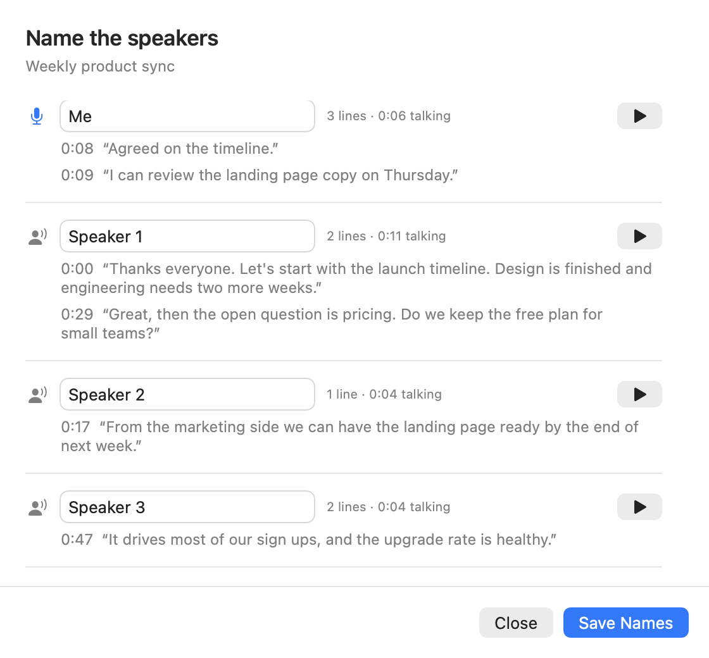
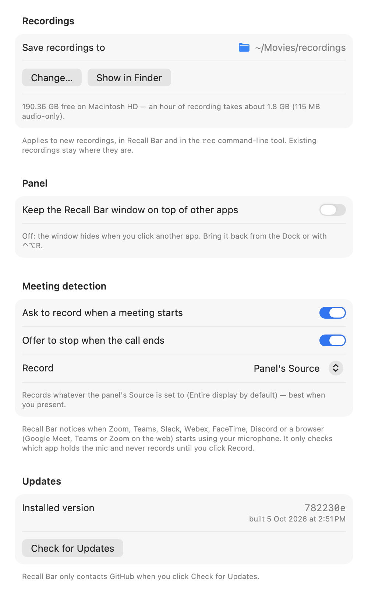

# Recall Bar — User Guide

Recall Bar records your online meetings on your Mac: the screen, what the
other people say, and what you say. It keeps your voice and theirs on
separate tracks, which makes transcripts more accurate, and it does all of
this on your Mac. Nothing is uploaded, no bot joins your call, and nothing
covers the screen you're presenting.

This guide walks through everything step by step. No technical background
needed.

**Contents**

1. [Before you start](#1-before-you-start)
2. [Install Recall Bar](#2-install-recall-bar)
3. [First launch: two permissions](#3-first-launch-two-permissions)
4. [Opening Recall Bar](#4-opening-recall-bar)
5. [Record a meeting](#5-record-a-meeting)
6. [Let Recall Bar notice your meetings](#6-let-recall-bar-notice-your-meetings)
7. [Mark important moments](#7-mark-important-moments)
8. [Find and play your recordings](#8-find-and-play-your-recordings)
9. [Transcribe and name the speakers](#9-transcribe-and-name-the-speakers)
10. [Share a recording](#10-share-a-recording)
11. [Settings](#11-settings)
12. [Update or uninstall](#12-update-or-uninstall)
13. [Troubleshooting](#13-troubleshooting)
14. [Privacy and recording etiquette](#14-privacy-and-recording-etiquette)
15. [Keyboard shortcuts](#15-keyboard-shortcuts)

---

## 1. Before you start

You need:

- **A Mac with macOS 15.2 or newer.** Check under  → About This Mac.
  Recall Bar is developed and tested on Apple silicon Macs (M1 and later).
- **About 5 minutes** for the install.
- **Homebrew** (optional but recommended): a free installer for tools that
  Recall Bar uses for transcription, audio clean-up and exporting. Get it from
  [brew.sh](https://brew.sh): copy the line shown on that page into Terminal
  and follow the prompts. Recording itself works without Homebrew.

## 2. Install Recall Bar

1. Open **Terminal**: press **⌘ Space**, type `Terminal`, press **Return**.
2. Copy this whole line, paste it into Terminal and press **Return**:

   ```
   curl -fsSL https://raw.githubusercontent.com/Apptechkai/recbar/main/install.sh | bash
   ```

3. **If a window asks to install "command line developer tools", click
   Install** and wait for it to finish. This is Apple's own software, and the
   download can take several minutes. The installer waits for it and then
   continues by itself.
4. When you see **"Recall Bar … is installed and open"**, you're done. Recall
   Bar's icon (a red record dot) appears in your Dock.

The installer never asks for your Mac password. You can run the same line
again later to update.

> **Getting help from ChatGPT or Claude?** Paste this into the chat: *"Help me
> install Recall Bar on my Mac. The official instructions are at
> https://github.com/Apptechkai/recbar — I need to run one command in
> Terminal. Walk me through opening Terminal and running it, then help me
> grant the two permissions it mentions. Don't suggest any other commands or
> sources."*

## 3. First launch: two permissions

macOS protects your screen and microphone, so Recall Bar has to ask once.

1. In Recall Bar, click **Start Recording**.
2. macOS asks for **Screen & System Audio Recording**. Click **Open System
   Settings** and switch **Recall Bar** on.
3. macOS asks for the **Microphone**. Click **Allow**.
4. **Quit Recall Bar** (the **Quit** button at the bottom of its window) **and
   open it again** from the Dock or Spotlight.

   This step matters: macOS only applies the screen-recording permission after
   Recall Bar restarts.

Recall Bar may also ask to send **notifications**. Allow them if you want it
to ask "Record this call?" when a call starts (see section 6).

## 4. Opening Recall Bar

Recall Bar lives in a small window, its **panel**. Open it any of these ways:

- Click the **Recall Bar icon in the Dock**.
- Press **⌃⌥R** (Control + Option + R) from any app.
- Click its **record icon in the menu bar** at the top of the screen, if
  your menu bar has room to show it.

By default the panel hides when you click into another app, so it never sits
on top of your meeting. To keep it visible, tick **Keep on top** at the
bottom of the panel.

## 5. Record a meeting


### Choose what to record

- **Source → Entire display** (the default) records everything on your
  screen. Use this if you'll be presenting or switching between apps.
- **Source → a window**: pick one from the list to record just that window.
- **The grid icon next to Source** opens a picker with live previews,
  in three tabs:
  - **Window**: one window.
  - **App**: every window of one app, for example Google Chrome. This is the
    easiest choice for browser meetings: it doesn't matter which Chrome window
    is in front.
  - **Entire screen**.

  When you record a window or an app, only **that app's sound** is recorded,
  so Slack pings or music from other apps stay out.
- **Mic**: leave it on **System default**, or pick your headset or AirPods.
  A headset gives the clearest recording of your own voice.
- **Options** (click to expand):
  - **Audio only (no video)**: much smaller files, about 115 MB per hour.
  - **Echo cancellation**: keeps the meeting sound coming out of your
    speakers off your own voice track. Leave it on.
  - **Clean up audio after stop (in background)**: evens out the volume and
    reduces background noise after you stop. Leave it on.

### Start, watch, stop

1. Click **Start Recording**. It shows **Starting…** for about two seconds
   while the microphone gets ready, so the recording begins with your mic
   already live.
2. While recording you'll see:
   - **REC 00:12:34** at the top of the panel, and a **REC** badge on the
     Dock icon, even when the panel is closed.
   - **Level meters** for your **Mic** and the **Meeting** sound. They should
     move when someone talks.
   - A small **live preview** of what's being recorded, so you can confirm
     it's the right window.
   - An orange **"No mic signal"** warning if your microphone goes completely
     silent, which usually means it's muted or the wrong one is selected.
3. You can close the panel. Recording continues.
4. Click **Stop Recording** when the meeting ends.

The file is saved within a second, and you can start another recording
straight away. Recall Bar then cleans up the audio in the background: a
**"Cleaning up audio"** strip in the panel shows the progress, roughly
2½ minutes per hour of recording.

## 6. Let Recall Bar notice your meetings

Recall Bar can notice when a meeting starts and ask whether to record it.
It recognises **Zoom, Microsoft Teams, Slack huddles, Webex, FaceTime,
WhatsApp, Discord**, and meetings in a browser (**Google Meet, Teams or Zoom on the
web** in Chrome, Edge, Brave, Arc, Firefox or Safari).

- When a meeting app starts using your microphone, Recall Bar asks **"Record
  this call?"**. You'll see a notification, plus a banner in the panel.
  Click **Record** or **Not Now**.
- When the call ends, Recall Bar offers to **stop the recording**. It waits
  until the meeting app has let go of the microphone for 8 seconds.

Recall Bar only checks *which app* is using the microphone, the same
information behind the orange mic dot in your menu bar. It never records
anything until you click **Record**. You can switch either part off in
**Settings → Meeting detection**.

## 7. Mark important moments

While recording, press **⌃⌥M** (Control + Option + M) from any app right
after something important is said. You can also click **Add Marker** in
the panel.

- The Dock badge briefly shows **★** and the panel lists your markers.
- After you stop, markers become **chapters** in the video. In QuickTime
  Player choose **View → Show Chapters** to jump straight to them.
- When you transcribe, the lines spoken in the **15 seconds before each
  marker** are highlighted with **★**.

## 8. Find and play your recordings

- Recordings are saved in your **Movies → recordings** folder by default.
  Click the **folder icon** at the bottom of the panel to open it, or change
  the location in **Settings**.
- Files are named by date and time, like `rec-2026-10-05-140213.mov`.
- **QuickTime Player** plays both sides of the conversation together.
- **VLC** plays one sound track at a time: choose **Audio → Audio Track →
  Track 2** to hear yourself.
- Size: about 1.8 GB per hour with video, about 115 MB per hour audio-only.

## 9. Transcribe and name the speakers

1. In the panel, click **Transcribe…** and choose a recording, or any video or
   audio file.
2. Tick **Translate to English** first if the meeting was in another language
   and you want English subtitles.
3. Wait for the progress bar. The **first transcription downloads speech
   models (about 1.5 GB)**, so it takes longer. Later ones are quicker:
   roughly a few minutes per hour of meeting.

The result is a subtitle file (`.srt`) next to the recording, which QuickTime
and VLC can show. Your own voice is labelled **[Me]**. The other people are
labelled **[Speaker 1]**, **[Speaker 2]** and so on, or **[Them]** if only
one person spoke.

### Name the speakers

Click **Name Speakers…** after transcribing. For an older transcript, use
**File → Name Speakers in a Transcript…**.



- Each voice shows a couple of things they said. Click **▶** to hear them.
- Type a name in the box, then click **Save Names**. The subtitles are
  rewritten with the names.
- If the same person shows up twice (say as Speaker 2 and Speaker 3), give
  both the **same name** and they're merged.
- Leave a name empty to go back to "Speaker 2" and so on.

Everything runs on your Mac. Nothing is sent anywhere.

## 10. Share a recording

Recordings keep the two sides of the conversation on separate tracks.
QuickTime plays both, but most other players and upload sites (YouTube,
Google Drive, Slack…) only play the first, so people would hear the meeting
but not you.

Before sharing, click **Export…** in the panel and pick the recording. Recall
Bar saves a copy ending in `-share.mp4` next to it, with both sides mixed
into one normal sound track. If there's a subtitle file, it's included and
can be switched on in the player. Tick **Burn subtitles into the video** to
make them always visible instead. That takes longer.

Your original recording is never changed.

## 11. Settings

Open **Settings** with the **gear icon** in the panel, or press **⌘ ,**.



- **Save recordings to**: choose another folder with **Change…**. It shows the
  free space there. If that folder isn't available when you start, for example
  because an external drive is unplugged, Recall Bar records to
  *Movies → recordings* instead and tells you.
- **Keep the Recall Bar window on top**: same as *Keep on top* in the panel.
- **Meeting detection**: turn the "Record this call?" prompts and the
  "call ended" offer on or off. **Record** chooses what a detected meeting
  records: the panel's Source, or **Meeting app only**.
- **Updates**: shows your version. See the next section.

## 12. Update or uninstall

**Update:** **Settings → Check for Updates**. If there's a new version, click
**Update Now**. Recall Bar downloads it, rebuilds itself and restarts in
about a minute. It won't update while you're recording or while audio is
being cleaned up.

**Uninstall:** paste this into Terminal:

```
curl -fsSL https://raw.githubusercontent.com/Apptechkai/recbar/main/install.sh | bash -s -- --uninstall
```

Your recordings are kept.

## 13. Troubleshooting

**Start Recording keeps asking for permission, even though it's switched on.**
The permission belongs to an older copy of Recall Bar. In System Settings →
Privacy & Security → Screen & System Audio Recording, select Recall Bar,
remove it with **−**, then start a recording and allow it again. Quit and
reopen Recall Bar afterwards.

**I can't see the Recall Bar icon in the menu bar.** A full menu bar hides
extra icons. Use the Dock icon or **⌃⌥R** instead.

**"No mic signal" while recording.** Your microphone is silent. Check that
it isn't muted, and that the right one is chosen under **Mic** before you
start.

**The meeting audio is silent in my recording.** If you recorded a single
window or app, only that app's sound is captured. Make sure it's the app the
meeting runs in, or record the **Entire display**.

**My voice is missing when I share the video.** Use **Export…** (section 10)
before sharing.

**The other people's voices are also on my track.** Keep **Echo
cancellation** on (Options). A headset avoids the problem completely.

**Clean-up, transcription or export says "ffmpeg not found" or
"whisperkit-cli not found".** Install Homebrew (section 1), then run the
install line again. It adds the missing tools.

**An orange "Clean-up skipped" note appears.** Your recording is fine; only
the volume levelling didn't run. The note says why.

**Transcription is slow the first time.** It's downloading the speech models
(about 1.5 GB). It only happens once.

**Something else?** Open an issue at
[github.com/Apptechkai/recbar/issues](https://github.com/Apptechkai/recbar/issues)
and describe what happened.

## 14. Privacy and recording etiquette

- Recordings and transcripts stay on your Mac. Recall Bar has no account and
  no tracking.
- It only goes online when you click **Check for Updates**, and once to
  download the transcription models the first time you transcribe.
- **Tell people when you're recording.** Many places require everyone's
  consent to record a conversation. Check the rules where you and the other
  participants are.

## 15. Keyboard shortcuts

| Shortcut | What it does |
| --- | --- |
| **⌃⌥R** | Open the Recall Bar panel from anywhere |
| **⌃⌥M** | Drop a ★ marker in the current recording |
| **⌘ ,** | Open Settings |
| **Return** | Start or Stop Recording (when the panel is open) |

---

Prefer the Terminal? Everything above also works from the `rec` command; see
the [README](../README.md#using-the-cli).
